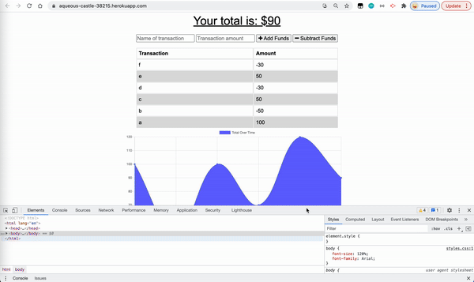

[](https://opensource.org/licenses/MIT)
# Budget Tracker

This application helps user to be able to track their withdrawals and deposits with or without a data/internet connection

## Table of Contents
* [Installation](#installation)
* [Built With](#built-with)
* [Features](#features)
* [Deployed Page](#deployed-page)
* [Author](#author)
* [Questions](#questions)
* [Acknowledgments](#acknowledgments)

## Installation
```bash
git clone https://github.com/qtian13/budget-tracker.git
```

## Built With
* [JavaScript](https://www.javascript.com/)
* [NodeJS](https://nodejs.org/en/)
* [npm](https://www.npmjs.com/)
* [indexedDB API](https://developer.mozilla.org/en-US/docs/Web/API/IndexedDB_API)
* [manifests](https://developer.mozilla.org/en-US/docs/Web/Manifest)
* [Service Worker API](https://developer.mozilla.org/en-US/docs/Web/API/Service_Worker_API)

## Features

* When user is on Budget App without an internet connection and inputs a withdrawal or deposit, that will be shown on the page, and added to their transaction history when their connection is back online.
  
## Deployed Page
The application is deployed on Heroku

Check the page: [https://aqueous-castle-38215.herokuapp.com/](https://aqueous-castle-38215.herokuapp.com/)

## Author
Qiushuang Tian
- [Link to Portfolio Site](https://qtian13.github.io/myPortfolio/)
- [Link to Github](https://github.com/qtian13)
- [Link to LinkedIn](https://www.linkedin.com/in/qiushuang-tian-a9754248/)

## Questions
Please reach me out with additional questions!

Emails: qiushuang.tian@gmail.com

## Acknowledgments
- [Berkeley Coding Boot Camp](https://bootcamp.berkeley.edu/coding/) provided starter code